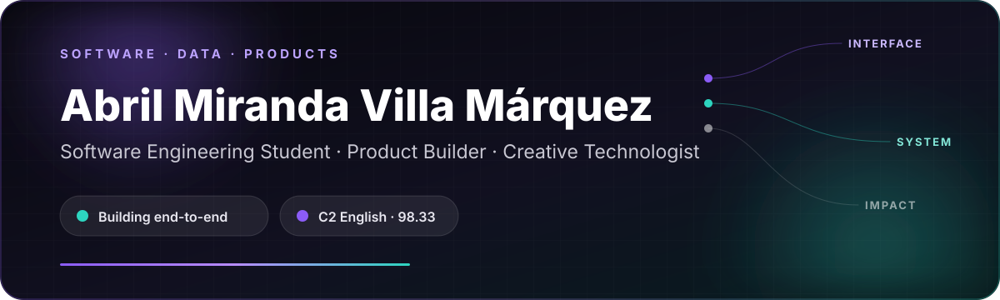

<div align="center">



<br>

[](https://www.linkedin.com/in/abrilmirandavilla)
[](https://abrilvillita.github.io)
[](https://devpost.com/mirandavilla341)
[](https://cert.efset.org/nTgMKy)

</div>

## Hello

I'm a Software Engineering student at **Tecmilenio** in Torreón, México. I turn ideas into end-to-end digital products: interface, logic, data, APIs, deployment and the small interactions that make software feel alive.

My work explores full-stack development, AI-assisted experiences, data, education, social impact and interactive storytelling. I learn technologies when a product needs them, document my decisions and stay honest about what is production-ready, experimental or still evolving.

| Current signal | Detail |
|---|---|
| **Academic performance** | 98.33 / 100 · 35% academic scholarship |
| **Languages** | Spanish — native · English — [C2 Proficient](https://cert.efset.org/nTgMKy) |
| **Technical direction** | Full-stack systems · cloud architecture · data · secure product development |
| **Creative direction** | Motion · human-centered interaction · visual storytelling |

## Selected work

| Project | Product and engineering scope | Explore |
|---|---|---|
| **TextHuman** | Live AI-assisted SaaS with authentication, subscriptions, document processing, payments, email, PostgreSQL and Cloudflare Workers | [Live product](https://humanizatexto.com) · [Repository](https://github.com/abrilvillita/TextHuman) |
| **MyFather** | Educational product prototype with progression systems, bilingual UX and an AI-assisted learning experience | [Prototype](https://myfather.app) · [Repository](https://github.com/abrilvillita/MyFather) |
| **Laguna HAWKS** | Animated public website created for a real student racing team and its sponsorship initiative | [Live demo](https://abrilvillita.github.io/Laguna-Hawks-Landing-Page/) · [Repository](https://github.com/abrilvillita/Laguna-Hawks-Landing-Page) |
| **Tiburones.exe** | Interactive browser game with narrative decisions, state-driven UI and local persistence | [Play](https://abrilvillita.github.io/Tiburones.exe/) · [Repository](https://github.com/abrilvillita/Tiburones.exe) |
| **ResQ+** | Emergency-response product concept exploring adaptive guidance, coordinated response and accessible crisis UX | [Prototype](https://github.com/abrilvillita/ResQ-Prototype) · [Landing](https://github.com/abrilvillita/ResQ-Project-Landing) |
| **Campaign Dashboard** | Collaborative planning system for tasks, budgets, proposals and shared notes in a student campaign | [Repository](https://github.com/abrilvillita/Student-Campaign-Dashboard) |

## How I build

```text
Problem → product flow → interface → application logic → data → integrations → deployment → iteration
```

<div align="center">


</div>

## Verified learning

- [**Red Hat System Administration I (RH124)**](https://www.credly.com/badges/1fc0e144-e0f8-4633-bcd1-1c2bc93687d1/public_url)
- **Oracle Academy — Java Fundamentals**
- [**Cisco Networking Academy — Introduction to Data Science**](https://www.credly.com/badges/da8c3137-b233-4c27-9817-08de8070505c/public_url)
- [**Tecmilenio — Object-Oriented Programming**](https://www.credly.com/badges/f96fa912-92ce-4d15-a410-d14c983bdb4b/public_url)
- [**Tecmilenio — Operating Systems**](https://www.credly.com/badges/a6f43000-0ab1-4b79-9f48-51b826b3f521/public_url)
- [**Tecmilenio — Data Science**](https://www.credly.com/badges/b4bc2c51-5ef3-425a-86f8-380ea3549f8a/public_url)
- [**EF SET English Certificate — C2 Proficient**](https://cert.efset.org/nTgMKy)

## Beyond the screen

Member of Tecmilenio's flag-football representative team · Multi-instrumentalist — guitar, bass and drums · Interested in drawing, motion and interactive design.

---

<div align="center">

### Build first. Learn deeply. Document honestly.

Torreón, Coahuila, México

</div>
